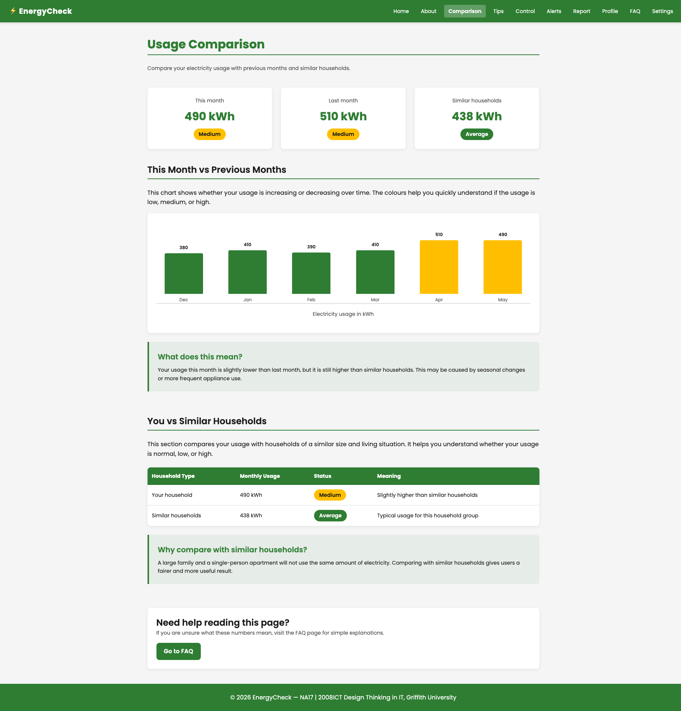
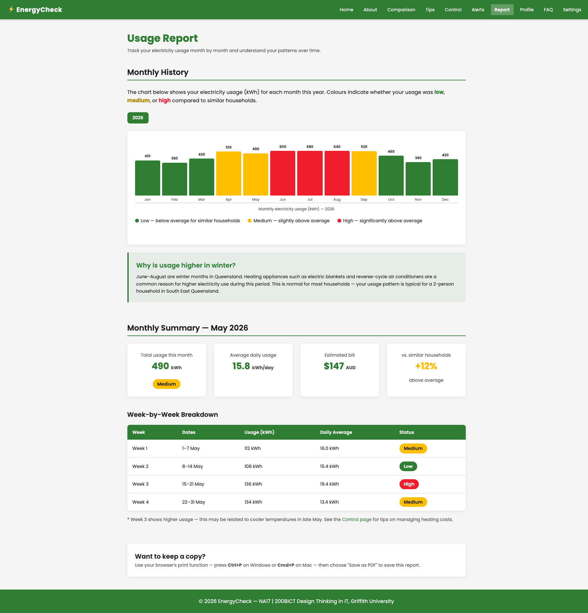

# EnergyCheck

A responsive front-end web app that helps Australian renters understand and manage their household electricity usage — built using HTML, CSS, and vanilla JavaScript.

🔗 **[Live Site](https://vy-trg.github.io/energycheck/)**

---

|  |  |
| --- | --- |



---

## About

EnergyCheck was designed to address a real gap: most energy feedback tools assume homeowners, not renters. The solution focuses on what renters can actually control — appliance usage, habits, and timing — without requiring landlord involvement.

The project followed a full Design Thinking process: empathy research, problem definition, ideation, prototyping, and user testing.

**My role:** Team Leader & Design Thinking Lead — I led the team and the design process, architected the shared stylesheet, and built the majority of the site. I reviewed and updated all pages for consistency, fixed accessibility issues, and added all JavaScript functionality post-submission.

---

## Built With

- **HTML5** — semantic markup, ARIA attributes
- **CSS3** — custom properties, responsive grid, flexbox, dark mode, print stylesheet
- **Vanilla JavaScript** — hamburger nav, dark mode with localStorage, bar chart tooltips
- No frameworks, no external APIs, no backend

---

## Features

- Colour-coded energy status indicator (green / amber / red)
- Monthly bar chart with hover tooltips showing exact kWh values
- Household comparison against similar-sized renters
- Renter-focused tips and control advice
- FAQ with plain-English explanations
- Dark mode — respects OS preference, overrideable in Settings, persists via localStorage
- High contrast mode for accessibility
- Responsive layout with working mobile hamburger menu
- Accessible navigation with `aria-label` and `aria-expanded`
- Print-ready report page (Cmd+P / Ctrl+P → Save as PDF)
- 404 page and sitemap.xml
- Homepage splash animation (homepage only)

---

## Pages

| File | Page |
| --- | --- |
| `index.html` | Home — energy meter and usage summary |
| `comparison.html` | Comparison — monthly bar chart and household data |
| `tips.html` | Tips — 8 actionable energy saving tips |
| `control.html` | Control — what renters can and cannot control |
| `alerts.html` | Alerts — usage alerts with suggested actions |
| `report.html` | Report — monthly usage report with print support |
| `profile.html` | Profile — household preferences and energy score |
| `faq.html` | FAQ — plain-English answers for common questions |
| `settings.html` | Settings — dark mode, notifications, display preferences |
| `about.html` | About — project purpose and how it works |
| `404.html` | 404 — friendly not found page |

---

## File Structure

```
energycheck/
├── index.html          # Homepage
├── *.html              # All other pages
├── style.css           # Shared stylesheet (CSS variables, layout, components)
├── reset.css           # Browser normalisation (loaded before style.css)
├── print.css           # Print styles for report.html
├── nav.js              # Hamburger menu, dark mode, active nav highlighting
├── tooltips.js         # Bar chart hover tooltips (comparison + report pages)
├── sitemap.xml         # Sitemap for search engines
├── 404.html            # Custom 404 page
└── assets/             # Screenshots for README
```

---

## Known Limitations

- Static prototype — no data is saved between visits (except theme preference)
- All usage values are hardcoded placeholder data
- No authentication or backend

---

## Team

| Name | Role |
| --- | --- |
| Thi Tuong Vy Truong | Team Leader / Design Thinking Lead |
| Yuxin Wang | Requirements |
| Ayat Taher Abdul Wahed | Storyboards |
| Vinoothna Vaddi | Control & Alerts |
| Rana Toor | Prototype & Branding |
